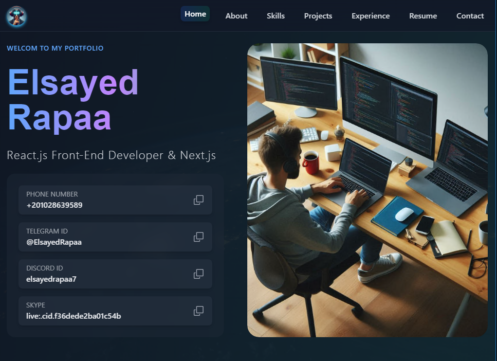

# Personal Portfolio

## 🌟 Overview

This project is a modern React application built with **React-Vite** for optimal performance and developer experience. The application features a responsive design, dynamic routing, and efficient state management to provide an excellent user experience.

## 🛠️ Technologies Used

- **React-Vite**: A faster build tool for modern React applications.
- **Tailwind CSS**: For utility-first styling and responsive design.
- **React-Router**: For seamless navigation between pages.
- **Zustand**: Lightweight state management for improved performance.
- **React-icons**: Icon library for customizable and scalable icons.
- **EmailJS**: For sending emails directly from the frontend.
- **React-hot-toast**: For interactive toast notifications.

## 📋 Features

- **Responsive Design**: Ensures a seamless experience on all devices.
- **Dynamic Routing**: Enables smooth navigation with React-Router.
- **State Management**: Utilizes Zustand for efficient state handling.
- **Email Functionality**: Integrated with EmailJS for sending messages.
- **Interactive Notifications**: Powered by React-hot-toast for user feedback.
